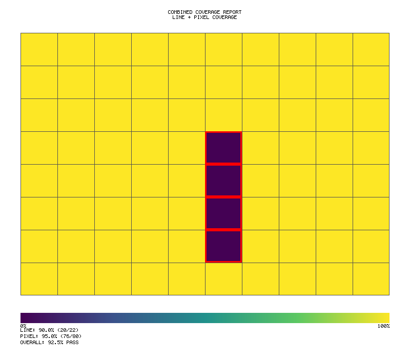

# Coverage Tooling

Probar includes advanced coverage instrumentation for WASM games.


## Overview

Traditional coverage tools (LLVM, gcov) don't work well with WASM. Probar implements a **renderfarm-inspired block coverage model** where:

- WASM code is decomposed into **coverage blocks** (like render buckets)
- Blocks are independently testable and falsifiable
- Coverage aggregation uses SIMD-accelerated operations via Trueno

## Basic Coverage

```rust
use jugar_probar::coverage::*;

// Enable coverage collection
let mut coverage = CoverageCollector::new();

// Run tests with coverage
coverage.start();
run_tests();
let report = coverage.finish();

// Print summary
println!("Line coverage: {:.1}%", report.line_coverage * 100.0);
println!("Branch coverage: {:.1}%", report.branch_coverage * 100.0);
println!("Function coverage: {:.1}%", report.function_coverage * 100.0);
```

## Block-Based Coverage

```rust
use jugar_probar::coverage::{BlockId, FunctionId, EdgeId};

// Type-safe identifiers (Poka-Yoke)
let block = BlockId::new(42);
let function = FunctionId::new(1);

// EdgeId encodes source and target
let edge = EdgeId::new(BlockId::new(10), BlockId::new(20));
assert_eq!(edge.source().as_u32(), 10);
assert_eq!(edge.target().as_u32(), 20);
```

## Thread-Local Buffering (Muda Elimination)

```rust
use jugar_probar::coverage::ThreadLocalCounters;

// Traditional: Atomic increment on every hit (contention)
// Probar: Thread-local buffering, batch flush

let counters = ThreadLocalCounters::new(1000);  // 1000 blocks

// Fast local increment
counters.hit(BlockId::new(42));

// Periodic flush to global
counters.flush();
```

## Running Coverage

### Via Makefile

```bash
# Full coverage report
make coverage

# E2E coverage
make test-e2e-coverage

# Quick summary
make coverage-summary

# Open HTML report
make coverage-open
```

### Via Cargo

```bash
# Generate report
cargo llvm-cov --html --output-dir target/coverage

# Summary only
cargo llvm-cov report --summary-only

# With nextest
cargo llvm-cov nextest --workspace
```

## Coverage Targets

| Metric | Minimum | Target |
|--------|---------|--------|
| Line Coverage | 85% | 95% |
| Branch Coverage | 75% | 90% |
| Function Coverage | 90% | 100% |
| Mutation Score | 80% | 90% |

## Coverage Report

```rust
pub struct CoverageReport {
    pub line_coverage: f64,
    pub branch_coverage: f64,
    pub function_coverage: f64,
    pub covered_lines: u32,
    pub total_lines: u32,
    pub covered_branches: u32,
    pub total_branches: u32,
    pub covered_functions: u32,
    pub total_functions: u32,
    pub uncovered_lines: Vec<LineInfo>,
}
```

## Superblock Scheduling

For parallel coverage analysis:

```rust
use jugar_probar::coverage::{Superblock, Scheduler};

// Group blocks into superblocks
let superblocks = Scheduler::create_superblocks(&blocks, num_workers);

// Execute in parallel
let results = superblocks
    .par_iter()
    .map(|sb| execute_superblock(sb))
    .collect();

// Merge results
let final_coverage = CoverageMerger::merge(&results);
```

## Soft Jidoka (Error Classification)

```rust
use jugar_probar::coverage::{Error, Severity};

// Distinguish fatal vs recoverable errors
match error.severity {
    Severity::Fatal => {
        // Stop immediately (Andon cord)
        panic!("Fatal error in coverage: {}", error);
    }
    Severity::Recoverable => {
        // Log and continue
        log::warn!("Recoverable error: {}", error);
        continue;
    }
    Severity::Ignorable => {
        // Skip silently
    }
}
```

## Coverage Example

```bash
cargo run --example coverage_demo -p jugar-probar
```

Output:
```
=== Probar Coverage Demo ===

--- Type-Safe Identifiers (Poka-Yoke) ---
BlockId(42) - Type-safe block identifier
FunctionId(1) - Type-safe function identifier
EdgeId(10 -> 20) - Encodes source and target

--- Thread-Local Counters (Muda Elimination) ---
Created counters for 1000 blocks
Hit block 42: 1000 times
Hit block 99: 500 times
After flush: block 42 = 1000, block 99 = 500

--- Superblock Scheduling ---
4 workers, 16 superblocks
Superblock 0: blocks [0..62]
Superblock 1: blocks [63..125]
...

✅ Coverage demo complete!
```

## llvm-cov + nextest Workflow Pattern

The recommended coverage workflow combines `llvm-cov` with `nextest` for faster, more reliable coverage:

### Makefile Pattern

```makefile
coverage:
	@cargo llvm-cov clean --workspace
	@mkdir -p target/coverage
	# Mold linker breaks coverage - temporarily disable
	@test -f ~/.cargo/config.toml && mv ~/.cargo/config.toml ~/.cargo/config.toml.cov-backup || true
	@cargo llvm-cov --no-report nextest --no-tests=warn --workspace
	@cargo llvm-cov report --html --output-dir target/coverage/html
	@cargo llvm-cov report --lcov --output-path target/coverage/lcov.info
	@test -f ~/.cargo/config.toml.cov-backup && mv ~/.cargo/config.toml.cov-backup ~/.cargo/config.toml || true
	@cargo llvm-cov report --summary-only
```

### Key Insights

1. **Use nextest with llvm-cov**: `cargo llvm-cov --no-report nextest` runs tests with coverage instrumentation while benefiting from nextest's parallel execution
2. **Mold linker workaround**: The mold linker (`~/.cargo/config.toml`) can break coverage instrumentation. Temporarily move the config during coverage runs.
3. **Two-phase approach**: Use `--no-report` first to collect data, then `report` to generate outputs
4. **GUI coverage integration**: Tests using probar's `UxCoverageTracker` are automatically instrumented
5. **Pixel coverage**: Image comparison tests (SSIM/PSNR/CIEDE2000) are also instrumented

### UxCoverageTracker Integration

Probar's `UxCoverageTracker` automatically integrates with llvm-cov:

```rust
use jugar_probar::prelude::*;

fn test_calculator_coverage() {
    let mut tracker = game_coverage();

    // Click operations are tracked
    tracker.click("btn-7");
    tracker.click("btn-plus");
    tracker.click("btn-3");
    tracker.click("btn-equals");

    // Generate coverage report
    let report = tracker.coverage_report();
    assert!(report.button_coverage() >= 0.8);
}
```

This test counts toward both:
- Traditional Rust line/branch coverage (via llvm-cov)
- GUI/UX coverage (via UxCoverageTracker)

## Visual Coverage Reports

Probar generates visual coverage heatmaps with multiple color palettes:

### Viridis Palette (Default)


### Magma Palette


### Heat Palette


### Combined Coverage Report


## Integration with CI

```yaml
- name: Generate coverage
  run: |
    cargo llvm-cov --lcov --output-path lcov.info
    cargo llvm-cov report --summary-only

- name: Upload coverage
  uses: codecov/codecov-action@v3
  with:
    files: lcov.info
```
