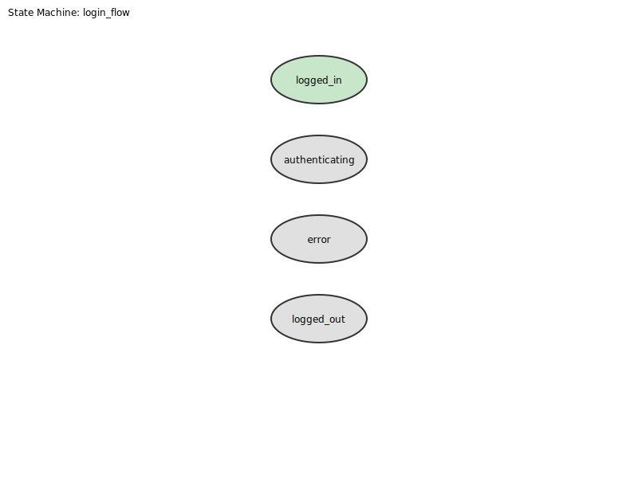

# Playbook State Machine Testing

Probar's playbook testing enables **YAML-driven state machine verification** with formal validation, mutation testing, and complexity analysis. This approach is inspired by W3C SCXML and academic research on statechart testing.

## Overview

Playbooks define:
- **State machines** with states, transitions, and invariants
- **Execution flows** with setup, steps, and teardown
- **Assertions** for path verification and output validation
- **Falsification protocols** via M1-M5 mutation testing

## Quick Start

Create a playbook file `login.yaml`:

```yaml
version: "1.0"
name: "Login Flow Test"
description: "Verify login state machine behavior"

machine:
  id: "login_flow"
  initial: "logged_out"
  states:
    logged_out:
      id: "logged_out"
      invariants:
        - description: "Login button visible"
          condition: "has_element('#login-btn')"
    authenticating:
      id: "authenticating"
    logged_in:
      id: "logged_in"
      final_state: true
    error:
      id: "error"

  transitions:
    - id: "submit"
      from: "logged_out"
      to: "authenticating"
      event: "click_login"
    - id: "success"
      from: "authenticating"
      to: "logged_in"
      event: "auth_ok"
    - id: "failure"
      from: "authenticating"
      to: "error"
      event: "auth_fail"
    - id: "retry"
      from: "error"
      to: "logged_out"
      event: "try_again"

  forbidden:
    - from: "logged_out"
      to: "logged_in"
      reason: "Cannot skip authentication"

performance:
  max_duration_ms: 5000
  max_memory_mb: 100
```

Run validation:

```bash
probar playbook login.yaml --validate
```

## State Machine Diagram

Here's a visualization of the login flow state machine:



The diagram shows:
- **States** as rounded rectangles (double border = final state)
- **Transitions** as arrows with event labels
- **Forbidden transitions** are checked at runtime

## State Machine Schema

### States

States define the possible configurations of your system:

```yaml
states:
  my_state:
    id: "my_state"
    final_state: false  # Optional, defaults to false
    invariants:         # Optional conditions that must hold
      - description: "Element must be visible"
        condition: "has_element('#my-element')"
```

### Transitions

Transitions define how the system moves between states:

```yaml
transitions:
  - id: "transition_id"
    from: "source_state"
    to: "target_state"
    event: "trigger_event"
    guard: "optional_condition"  # Only trigger if guard is true
    actions:                     # Optional actions to execute
      - type: click
        selector: "#button"
    assertions:                  # Optional assertions to check
      - type: element_exists
        selector: "#result"
```

### Forbidden Transitions

Define transitions that must never occur:

```yaml
forbidden:
  - from: "logged_out"
    to: "logged_in"
    reason: "Authentication cannot be bypassed"
```

## Playbook Execution

### Lifecycle

Playbooks execute in three phases:

1. **Setup**: Prepare the test environment
2. **Steps**: Execute state transitions
3. **Teardown**: Clean up (runs even on failure)

```yaml
playbook:
  setup:
    - type: navigate
      url: "https://example.com/login"
    - type: wait
      selector: "#login-form"

  steps:
    - name: "Enter credentials"
      transitions: ["submit"]
      capture:
        - var: "session_id"
          from: "#session-token"

    - name: "Wait for auth"
      transitions: ["success"]
      timeout_ms: 3000

  teardown:
    - type: screenshot
      path: "final_state.png"
      ignore_errors: true
```

### Variable Capture

Capture values during execution for later assertion:

```yaml
steps:
  - name: "Capture result"
    transitions: ["process"]
    capture:
      - var: "output"
        from: "#result"
      - var: "timestamp"
        from: "#time"
```

Variables can be referenced with `${var}` syntax:

```yaml
- type: assert
  condition: "${output} contains 'success'"
```

## Assertions

### Path Assertions

Verify the execution path through the state machine:

```yaml
assertions:
  path:
    must_visit: ["logged_out", "authenticating", "logged_in"]
    must_not_visit: ["error"]
    ends_at: "logged_in"
```

### Output Assertions

Verify captured variable values:

```yaml
assertions:
  output:
    - var: "session_id"
      not_empty: true
    - var: "response_time"
      less_than: 1000
    - var: "status"
      equals: "success"
    - var: "message"
      matches: "Welcome.*"
```

### Complexity Assertions

Verify algorithmic complexity is O(n) or better:

```yaml
assertions:
  complexity:
    operation: "search"
    expected: "linear"
    tolerance: 0.1
```

## State Machine Validation

Probar validates your state machine for common issues:

| Issue | Severity | Description |
|-------|----------|-------------|
| Orphaned State | Error | State unreachable from initial |
| Dead End | Error | Non-final state with no outgoing transitions |
| No Path to Final | Warning | State cannot reach any final state |
| Non-Deterministic | Warning | Same event triggers multiple transitions |
| Unguarded Self-Loop | Warning | Potential infinite loop |

Run validation:

```bash
probar playbook my_playbook.yaml --validate
```

## Mutation Testing (M1-M5)

The falsification protocol uses five mutation classes to verify test quality:

| Class | Name | Description |
|-------|------|-------------|
| M1 | State Removal | Remove a state from the machine |
| M2 | Transition Removal | Remove a transition |
| M3 | Event Swap | Swap events between transitions |
| M4 | Target Swap | Change transition target state |
| M5 | Guard Negation | Negate guard conditions |

Run mutation testing:

```bash
# All mutation classes
probar playbook login.yaml --mutate

# Specific classes
probar playbook login.yaml --mutate --mutation-classes M1,M2,M3
```

A good test suite should "kill" (detect) most mutants. Target: **80%+ mutation score**.

## Diagram Export

Export state machine diagrams for visualization:

```bash
# DOT format (Graphviz)
probar playbook login.yaml --export dot --export-output diagram.dot
dot -Tpng diagram.dot -o diagram.png

# SVG format
probar playbook login.yaml --export svg --export-output diagram.svg
```

## CLI Reference

```bash
probar playbook [OPTIONS] <FILES>...

Arguments:
  <FILES>...  Playbook YAML file(s) to run

Options:
      --validate              Validate without execution
      --export <FORMAT>       Export diagram (dot, svg)
      --export-output <PATH>  Output file for diagram
      --mutate                Run mutation testing
      --mutation-classes <M>  Specific classes (M1,M2,M3,M4,M5)
      --fail-fast             Stop on first error
      --continue-on-error     Keep going on step failure
  -f, --format <FORMAT>       Output format (text, json, junit)
  -o, --output <DIR>          Output directory
```

## Programmatic API

```rust
use jugar_probar::playbook::{
    Playbook, StateMachineValidator, MutationGenerator, MutationClass,
    to_dot, to_svg, calculate_mutation_score,
};

// Parse playbook
let playbook = Playbook::from_yaml(yaml_content)?;

// Validate state machine
let validator = StateMachineValidator::new(&playbook);
let result = validator.validate();

if !result.is_valid {
    for issue in &result.issues {
        println!("Issue: {:?}", issue);
    }
}

// Generate mutations
let generator = MutationGenerator::new(&playbook);
let mutants = generator.generate_all();

// Export diagram
let svg = to_svg(&playbook);
std::fs::write("diagram.svg", svg)?;
```

## Example Output

```
$ probar playbook login.yaml --validate

Running playbook(s)...

Processing: login.yaml
  State machine: login_flow
  States: 4
  Transitions: 4
  Valid: yes
  Validation only mode - skipping execution

$ probar playbook login.yaml --mutate

Running playbook(s)...

Processing: login.yaml
  State machine: login_flow
  States: 4
  Transitions: 4
  Valid: yes
  Running mutation testing (5 classes)...
    M1: 3 mutants
    M2: 4 mutants
    M3: 3 mutants
    M4: 12 mutants
    M5: 1 mutants
  Total mutants generated: 23
```

## Best Practices

1. **Start with validation** - Always run `--validate` first
2. **Define forbidden transitions** - Explicitly state what shouldn't happen
3. **Mark final states** - Ensure reachability analysis works
4. **Use guards for determinism** - Avoid ambiguous transitions
5. **Target 80%+ mutation score** - Ensures comprehensive testing
6. **Export diagrams for review** - Visual verification catches errors

## PlaybookRunner API

For programmatic execution with custom executors:

```rust
use jugar_probar::playbook::{
    Playbook, PlaybookRunner, ActionExecutor, ExecutorError, WaitCondition,
};

// Implement your custom executor
struct MyExecutor;

impl ActionExecutor for MyExecutor {
    fn click(&mut self, selector: &str) -> Result<(), ExecutorError> {
        println!("Clicking: {}", selector);
        Ok(())
    }

    fn type_text(&mut self, selector: &str, text: &str) -> Result<(), ExecutorError> {
        println!("Typing '{}' into {}", text, selector);
        Ok(())
    }

    fn wait(&mut self, _condition: &WaitCondition) -> Result<(), ExecutorError> {
        Ok(())
    }

    fn navigate(&mut self, url: &str) -> Result<(), ExecutorError> {
        println!("Navigating to: {}", url);
        Ok(())
    }

    fn execute_script(&mut self, code: &str) -> Result<String, ExecutorError> {
        println!("Executing script: {}", code);
        Ok("result".to_string())
    }

    fn screenshot(&mut self, name: &str) -> Result<(), ExecutorError> {
        println!("Taking screenshot: {}", name);
        Ok(())
    }

    fn element_exists(&self, selector: &str) -> Result<bool, ExecutorError> {
        Ok(selector.starts_with("#"))
    }

    fn get_text(&self, _selector: &str) -> Result<String, ExecutorError> {
        Ok("Sample text".to_string())
    }

    fn get_attribute(&self, _selector: &str, _attr: &str) -> Result<String, ExecutorError> {
        Ok("value".to_string())
    }

    fn get_url(&self) -> Result<String, ExecutorError> {
        Ok("http://localhost/app".to_string())
    }

    fn evaluate(&self, _expression: &str) -> Result<bool, ExecutorError> {
        Ok(true)
    }
}

// Run the playbook
fn test_playbook() {
    let yaml = r#"
version: "1.0"
machine:
  id: "test"
  initial: "start"
  states:
    start: { id: "start" }
    end: { id: "end", final_state: true }
  transitions:
    - id: "t1"
      from: "start"
      to: "end"
      event: "go"
playbook:
  steps:
    - name: "Go to end"
      transitions: ["t1"]
      capture:
        - var: "result"
          from: "captured_value"
assertions:
  path:
    expected: ["start", "end"]
  output:
    - var: "result"
      not_empty: true
"#;

    let playbook = Playbook::from_yaml(yaml).unwrap();
    let mut runner = PlaybookRunner::new(playbook, MyExecutor);

    let result = runner.run();

    assert!(result.passed);
    assert_eq!(result.state_path, vec!["start", "end"]);
    println!("Playbook passed: {:?}", result.variables);
}
```

## Output Assertion Types

| Type | Description | Example |
|------|-------------|---------|
| `not_empty` | Variable must have a value | `not_empty: true` |
| `equals` | Exact string match | `equals: "success"` |
| `matches` | Regex pattern match | `matches: "^[0-9]+$"` |
| `less_than` | Numeric comparison | `less_than: 100` |
| `greater_than` | Numeric comparison | `greater_than: 0` |

## References

- [W3C SCXML Specification](https://www.w3.org/TR/scxml/)
- Lamport, "Specifying Systems" (TLA+)
- Fabbri et al., "Mutation Testing Applied to Statecharts" (ISSRE 1999)
- Goldsmith et al., "Measuring Empirical Computational Complexity" (ESEC/FSE 2007)
