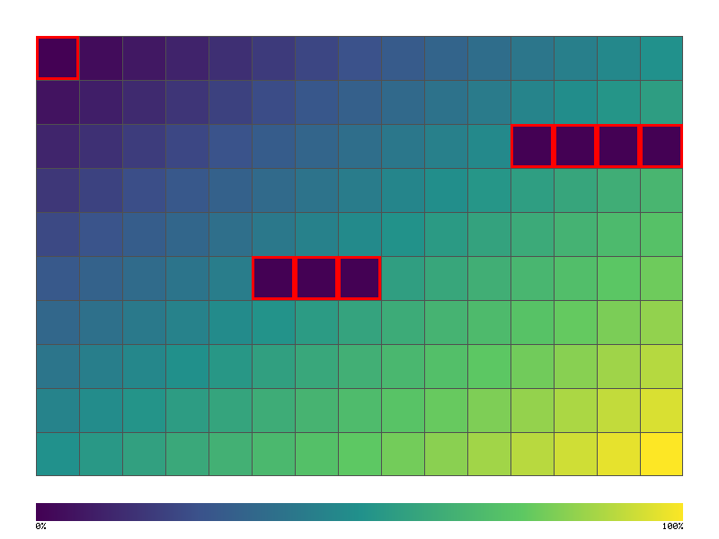

# TUI Testing



> **Toyota Way**: Mieruka (Visibility) - Visual TUI verification

Test terminal user interfaces with frame capture and comparison.

## Architecture

```
┌─────────────────────────────────────────────────────────────────┐
│                    TUI TESTING ARCHITECTURE                      │
├─────────────────────────────────────────────────────────────────┤
│                                                                   │
│  ┌──────────────┐       ┌──────────────┐       ┌──────────────┐ │
│  │   Your TUI   │       │   TestBackend │      │  Frame       │ │
│  │   App        │──────►│   (ratatui)  │──────►│  Buffer      │ │
│  │              │       │              │       │              │ │
│  └──────────────┘       └──────────────┘       └──────┬───────┘ │
│                                                       │          │
│                         ┌─────────────────────────────┘          │
│                         ▼                                        │
│              ┌──────────────────┐                                │
│              │  Frame Capture   │                                │
│              │  ┌────────────┐  │                                │
│              │  │████████████│  │                                │
│              │  │█ Menu    █│  │                                │
│              │  │█ > Item1 █│  │                                │
│              │  │█   Item2 █│  │                                │
│              │  │████████████│  │                                │
│              │  └────────────┘  │                                │
│              └──────────────────┘                                │
│                         │                                        │
│         ┌───────────────┼───────────────┐                       │
│         ▼               ▼               ▼                       │
│  ┌────────────┐  ┌────────────┐  ┌────────────┐                 │
│  │  Compare   │  │  Assert    │  │  Snapshot  │                 │
│  │  Frames    │  │  Content   │  │  Storage   │                 │
│  └────────────┘  └────────────┘  └────────────┘                 │
│                                                                   │
└─────────────────────────────────────────────────────────────────┘
```

## Quick Start

```rust
use jugar_probar::tui::{TuiTestHarness, FrameAssert};
use ratatui::backend::TestBackend;
use ratatui::Terminal;

#[test]
fn test_menu_renders() {
    // Create test backend
    let backend = TestBackend::new(80, 24);
    let mut terminal = Terminal::new(backend).unwrap();

    // Render your UI
    terminal.draw(|frame| {
        render_menu(frame);
    }).unwrap();

    // Capture frame
    let buffer = terminal.backend().buffer();

    // Assert content
    assert!(buffer.get(0, 0).symbol() == "┌");
    assert!(buffer_contains_text(buffer, "Menu"));
}
```

## Frame Buffer Assertions

```rust
use jugar_probar::tui::FrameAssert;

// Assert specific cell content
frame.assert_cell(10, 5, "█");

// Assert text at position
frame.assert_text(0, 0, "┌────────┐");

// Assert area contains text
frame.assert_contains("Welcome");

// Assert styled text
frame.assert_style(10, 5, Style::default().fg(Color::Green));
```

## Snapshot Testing

```rust
use jugar_probar::tui::TuiSnapshot;

#[test]
fn test_ui_snapshot() {
    let mut terminal = create_test_terminal();
    render_app(&mut terminal);

    // Compare against stored snapshot
    TuiSnapshot::assert_matches(
        terminal.backend().buffer(),
        "snapshots/main_menu.snap"
    );
}
```

## Example: Calculator TUI

```rust
use ratatui::widgets::{Block, Borders, Paragraph};
use ratatui::layout::{Layout, Direction, Constraint};

fn render_calculator(frame: &mut Frame) {
    let chunks = Layout::default()
        .direction(Direction::Vertical)
        .constraints([
            Constraint::Length(3),  // Display
            Constraint::Min(5),     // Keypad
        ])
        .split(frame.size());

    // Display
    let display = Paragraph::new("42")
        .block(Block::default().borders(Borders::ALL).title("Display"));
    frame.render_widget(display, chunks[0]);

    // Keypad
    let keypad = Paragraph::new("7 8 9 /\n4 5 6 *\n1 2 3 -\n0 . = +")
        .block(Block::default().borders(Borders::ALL).title("Keys"));
    frame.render_widget(keypad, chunks[1]);
}

#[test]
fn test_calculator_display() {
    let backend = TestBackend::new(40, 12);
    let mut terminal = Terminal::new(backend).unwrap();

    terminal.draw(render_calculator).unwrap();

    let buffer = terminal.backend().buffer();

    // Verify display shows "42"
    assert!(buffer_contains_text(buffer, "42"));

    // Verify keypad layout
    assert!(buffer_contains_text(buffer, "7 8 9"));
}
```

## TUI Frame Capture Output

```
┌──────────────────────────────────────┐
│            ┌─Display─────────────┐   │
│            │                  42 │   │
│            └─────────────────────┘   │
│            ┌─Keys────────────────┐   │
│            │  7   8   9   /      │   │
│            │  4   5   6   *      │   │
│            │  1   2   3   -      │   │
│            │  0   .   =   +      │   │
│            └─────────────────────┘   │
└──────────────────────────────────────┘
```

## Input Simulation

```rust
use jugar_probar::tui::InputSimulator;
use crossterm::event::{KeyCode, KeyEvent, KeyModifiers};

#[test]
fn test_keyboard_navigation() {
    let mut app = MyApp::new();
    let mut terminal = create_test_terminal();

    // Simulate key press
    app.handle_key(KeyEvent::new(KeyCode::Down, KeyModifiers::empty()));

    // Render and verify
    terminal.draw(|f| app.render(f)).unwrap();

    // Menu should have moved down
    assert!(terminal.backend().buffer().contains("► Item 2"));
}
```

## Integration with GUI Coverage

```rust
use jugar_probar::{gui_coverage, tui::TuiTestHarness};

#[test]
fn test_tui_with_coverage() {
    let mut gui = gui_coverage! {
        buttons: ["btn-7", "btn-8", "btn-9", "btn-plus", "btn-equals"],
        screens: ["calculator", "settings"]
    };

    let mut app = Calculator::new();
    let mut terminal = create_test_terminal();

    // Simulate interactions
    app.press_key('7');
    gui.click("btn-7");

    app.press_key('+');
    gui.click("btn-plus");

    app.press_key('1');
    app.press_key('=');
    gui.click("btn-equals");

    gui.visit("calculator");

    // Verify display
    terminal.draw(|f| app.render(f)).unwrap();
    assert!(terminal.backend().buffer().contains("8"));

    // Check coverage
    println!("{}", gui.summary());
    assert!(gui.meets(60.0));
}
```

## Running the TUI Calculator Demo

```bash
cargo run -p showcase-calculator --example calculator_tui_demo
```

Output:
```
════════════════════════════════════════
       SHOWCASE CALCULATOR (TUI)
════════════════════════════════════════

┌─ Display ─────────────────────────────┐
│                                    42 │
└───────────────────────────────────────┘
┌─ Keypad ──────────────────────────────┐
│                                       │
│    7     8     9     /                │
│    4     5     6     *                │
│    1     2     3     -                │
│    0     .     =     +                │
│                                       │
│    C     ±     %     AC               │
│                                       │
└───────────────────────────────────────┘

Press 'q' to quit, numbers and operators to calculate
```

## API Reference

### TuiTestHarness

| Method | Description |
|--------|-------------|
| `new(width, height)` | Create test harness |
| `terminal()` | Get terminal reference |
| `render(widget)` | Render widget to test buffer |
| `buffer()` | Get current frame buffer |
| `assert_contains(text)` | Assert buffer contains text |
| `snapshot(name)` | Save/compare snapshot |

### FrameAssert

| Method | Description |
|--------|-------------|
| `assert_cell(x, y, symbol)` | Assert cell symbol |
| `assert_text(x, y, text)` | Assert text at position |
| `assert_style(x, y, style)` | Assert cell style |
| `assert_contains(text)` | Assert text anywhere |
| `assert_not_contains(text)` | Assert text not present |

### InputSimulator

| Method | Description |
|--------|-------------|
| `key(code)` | Simulate key press |
| `char(c)` | Simulate character input |
| `mouse(x, y, button)` | Simulate mouse click |
| `resize(w, h)` | Simulate terminal resize |
