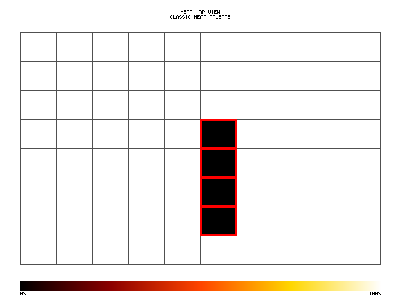

# Watch Mode



> **Toyota Way**: Genchi Genbutsu (Go and See) - Real-time feedback on changes

Hot reload during development with file watching for rapid test iteration.

## Running the Example

```bash
cargo run --example watch_mode
```

## Quick Start

```rust
use probar::watch::{WatchConfig, FileWatcher};

// Create a watcher with default settings
let config = WatchConfig::default();
let watcher = FileWatcher::new(config)?;

// Start watching
watcher.start(|change| {
    println!("File changed: {:?}", change.path);
    // Re-run tests
})?;
```

## Watch Configuration

```rust
use probar::watch::WatchConfig;
use std::path::Path;

// Default configuration
let default = WatchConfig::default();

// Custom configuration
let config = WatchConfig::new()
    .with_pattern("**/*.rs")
    .with_pattern("**/*.toml")
    .with_ignore("**/target/**")
    .with_ignore("**/.git/**")
    .with_debounce(300)  // 300ms debounce
    .with_clear_screen(true)
    .with_watch_dir(Path::new("src"))
    .with_watch_dir(Path::new("tests"));

println!("Patterns: {:?}", config.patterns);
println!("Debounce: {}ms", config.debounce_ms);
println!("Clear screen: {}", config.clear_screen);
```

## File Changes

```rust
use probar::watch::{FileChange, FileChangeKind};

// File change events
fn handle_change(change: FileChange) {
    println!("Path: {:?}", change.path);
    println!("Kind: {:?}", change.kind);
    println!("Time: {:?}", change.timestamp);

    match change.kind {
        FileChangeKind::Created => println!("New file created"),
        FileChangeKind::Modified => println!("File was modified"),
        FileChangeKind::Deleted => println!("File was deleted"),
        FileChangeKind::Renamed => println!("File was renamed"),
    }
}
```

## Pattern Matching

```rust
use probar::watch::WatchConfig;
use std::path::Path;

let config = WatchConfig::new()
    .with_pattern("**/*.rs")      // All Rust files
    .with_pattern("**/*.toml")    // All TOML files
    .with_pattern("src/**")       // Everything in src
    .with_ignore("**/target/**")  // Ignore target directory
    .with_ignore("**/*.bak");     // Ignore backup files

// Check if path matches
let path = Path::new("src/lib.rs");
if config.matches_pattern(path) {
    println!("Path matches watch patterns");
}

let ignored = Path::new("target/debug/main");
if !config.matches_pattern(ignored) {
    println!("Path is ignored");
}
```

## Watch Builder

```rust
use probar::watch::WatchBuilder;
use std::path::Path;

// Fluent builder pattern
let watcher = WatchBuilder::new()
    .watch_dir("src")
    .watch_dir("tests")
    .pattern("**/*.rs")
    .pattern("**/*.toml")
    .ignore("**/target/**")
    .debounce_ms(200)
    .clear_screen(true)
    .run_on_start(true)
    .on_change(|change| {
        println!("Changed: {:?}", change.path);
    })
    .build()?;
```

## Custom Watch Handlers

```rust
use probar::watch::{WatchHandler, FileChange, WatchStats};

// Implement custom handler
struct TestRunner {
    test_count: usize,
}

impl WatchHandler for TestRunner {
    fn on_change(&mut self, change: FileChange) {
        println!("Running tests after change to {:?}", change.path);
        self.test_count += 1;
        // Run tests here
    }

    fn on_error(&mut self, error: &str) {
        eprintln!("Watch error: {}", error);
    }
}

// Use custom handler
let handler = TestRunner { test_count: 0 };
// let watcher = FileWatcher::with_handler(config, handler)?;
```

## Watch Statistics

```rust
use probar::watch::{FileWatcher, WatchStats};

// Get watch statistics
let stats = WatchStats::default();
println!("Changes detected: {}", stats.changes_detected);
println!("Tests run: {}", stats.tests_run);
println!("Last change: {:?}", stats.last_change);
println!("Uptime: {:?}", stats.uptime());
```

## Debouncing

Debouncing prevents multiple rapid file saves from triggering multiple test runs:

```rust
use probar::watch::WatchConfig;

// Fast debounce for quick iteration
let fast = WatchConfig::new()
    .with_debounce(100);  // 100ms

// Slower debounce for large projects
let slow = WatchConfig::new()
    .with_debounce(500);  // 500ms

// How debouncing works:
// 1. File change detected at t=0
// 2. Another change at t=50ms - timer resets
// 3. No changes for debounce_ms
// 4. Handler is called once
```

## Integration with Test Runner

```rust
use probar::watch::{WatchConfig, FileWatcher};
use probar::{TestHarness, TestSuite};

fn watch_tests() {
    let config = WatchConfig::new()
        .with_pattern("src/**/*.rs")
        .with_pattern("tests/**/*.rs")
        .with_debounce(300)
        .with_clear_screen(true);

    // Load test suite
    let suite = TestSuite::new("my_tests");

    // Watch for changes
    // FileWatcher::new(config)?.start(|change| {
    //     // Clear screen if configured
    //     print!("\x1B[2J\x1B[1;1H");
    //
    //     println!("Change: {:?}", change.path);
    //     println!("Running tests...\n");
    //
    //     // Run affected tests
    //     let harness = TestHarness::new();
    //     let results = harness.run(&suite);
    //
    //     println!("\n{} passed, {} failed",
    //         results.passed_count(),
    //         results.failed_count());
    // })?;
}
```

## Filtering by File Type

```rust
use probar::watch::{WatchConfig, FileChange};

let config = WatchConfig::new()
    .with_pattern("**/*.rs")
    .with_pattern("**/*.toml");

fn handle_by_type(change: FileChange) {
    let path = change.path.to_string_lossy();

    if path.ends_with(".rs") {
        println!("Rust file changed - running tests");
        // run_tests();
    } else if path.ends_with(".toml") {
        println!("Config changed - reloading");
        // reload_config();
    }
}
```

## Smart Test Selection

```rust
use probar::watch::FileChange;
use std::path::Path;

// Run only affected tests based on changed file
fn select_tests(change: &FileChange) -> Vec<String> {
    let path = &change.path;
    let mut tests = Vec::new();

    // If a module changed, run its tests
    if let Some(name) = path.file_stem() {
        let test_name = format!("test_{}", name.to_string_lossy());
        tests.push(test_name);
    }

    // If a test file changed, run that test
    if path.starts_with("tests/") {
        if let Some(name) = path.file_stem() {
            tests.push(name.to_string_lossy().to_string());
        }
    }

    tests
}
```

## Closure-Based Handlers

```rust
use probar::watch::{WatchConfig, FnWatchHandler};

// Simple closure handler
let handler = FnWatchHandler::new(|change| {
    println!("File changed: {:?}", change.path);
});

// With state (using move)
let mut run_count = 0;
let stateful = FnWatchHandler::new(move |change| {
    run_count += 1;
    println!("Run #{}: {:?}", run_count, change.path);
});
```

## Best Practices

1. **Appropriate Debounce**: Balance between responsiveness and avoiding duplicate runs
2. **Ignore Build Artifacts**: Always ignore `target/`, `.git/`, etc.
3. **Clear Screen**: Enable for better readability in continuous testing
4. **Smart Filtering**: Only re-run tests affected by the changed files
5. **Error Handling**: Handle watch errors gracefully (disk full, permissions)
6. **Resource Cleanup**: Ensure watchers are properly stopped on exit
